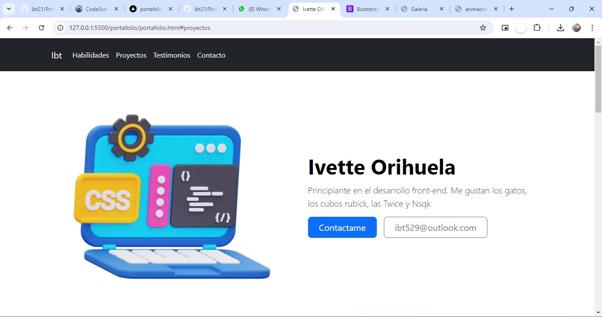

# Mi portafolio de habilidades de tecnolochicas Pro 

El presente proyecto es un portafolio desarrollado para poner en práctiva las habilidades obtenidas dentro del bootcamp de desarrollo fronted de Technolochicas pro.

fue desarrollado en HTML, CSS y JS con el uso del framework de UI, bootstrap utilizando además bibliotecas externas.

La página es responsiva (adaptativa a diferentes tamaños de pantalla) e incluye la presentación de la autora del proyecto.

[Proyecto desplegado](http://127.0.0.1:5500/portafolio/portafolio.html)

## secciones de mi sitio

## tecnologías

* HTML
* CSS
* Bootsrap
* Javascript

---

Desarrollado con amor por [ibt](https://www.instagram.com/gatodurazon/) en technolochicaspro 